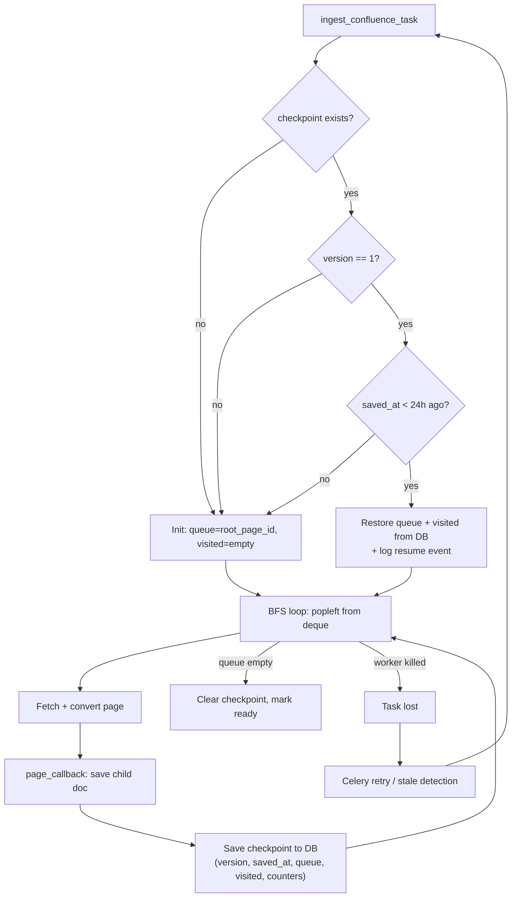

# Confluence Crawl Checkpoint (resumable crawling)

## Problem

The Confluence crawler runs inside a single Celery task `ingest_confluence_task`.
The BFS queue (`queue`) and the set of visited pages (`visited`) are stored
**only in memory**. If the worker restarts (deploy, OOM, crash), the task is
lost. Already-processed child pages are safely persisted, but unprocessed
page IDs from the BFS queue are gone.

## Solution

Persist a checkpoint (queue + visited + counters) in a JSONB field on the
placeholder Document after every processed page. On task start, restore the
checkpoint if it exists and resume from where the crawl left off.



## Affected files

| File | Change |
|------|--------|
| `backend/app/models.py` | Add `crawl_checkpoint` JSONB field to Document |
| `backend/db/schema.sql` | `ALTER TABLE documents ADD COLUMN IF NOT EXISTS crawl_checkpoint JSONB` |
| `backend/app/ingestion/converters/confluence.py` | Accept `initial_queue`/`initial_visited` params; expose current BFS state in callback |
| `backend/app/celery_app.py` | Load/save checkpoint in `ingest_confluence_task` |

## Implementation details

### 1. New field `crawl_checkpoint` on Document

```python
crawl_checkpoint: Mapped[dict | None] = mapped_column(JSONB, nullable=True)
```

Checkpoint format:

```json
{
  "version": 1,
  "saved_at": "2026-03-28T12:34:56Z",
  "queue": [["page_id_1", 2], ["page_id_2", 3]],
  "visited": ["root_id", "page_id_A", "page_id_B"],
  "dispatched": 109,
  "skipped": 5,
  "errors": 0,
  "pages_seen": 143
}
```

- `version` — schema version for forward compatibility. If the loader
  encounters an unknown version it discards the checkpoint and starts fresh.
- `saved_at` — ISO-8601 UTC timestamp. Used for TTL: checkpoints older than
  24 hours are discarded (Confluence content may have changed significantly).
- `pages_seen` — pages processed so far (not the total number of pages in
  the space).

### 2. Changes to `crawl_confluence()`

**BFS queue type:** Replace `queue: list[tuple[str, int]]` with
`collections.deque` for O(1) `popleft()` (current `queue.pop(0)` is O(n)).
Serialization: `list(queue)` → JSON array; deserialization:
`deque(checkpoint["queue"])`.

**New optional parameters:**

- `initial_queue: list[tuple[str, int]] | None` — restored BFS queue.
  Accepts a plain `list` (from JSON deserialization); the function converts
  it to `deque` internally.
- `initial_visited: set[str] | None` — already-visited page IDs

When provided, use them instead of the default `[(root_page_id, 0)]` / `set()`.

**Checkpoint callback:** After each processed page, pass the current `queue`
and `visited` snapshots so the caller can persist them. The simplest approach
is to add a `checkpoint_callback(queue_snapshot, visited_snapshot)` called
right after `page_callback`. At the call site, `queue` already contains the
newly discovered children/links (lines 566-573 in the current code), so the
snapshot is up to date.

### 3. Save checkpoint in `_on_page` (celery_app.py)

In the `_on_page` progress-update section (where `progress_stage` is already
written), also write the checkpoint:

```python
from datetime import datetime, timezone

ph.crawl_checkpoint = {
    "version": 1,
    "saved_at": datetime.now(timezone.utc).isoformat(),
    "queue": [[pid, d] for pid, d in current_queue],
    "visited": list(current_visited),
    "dispatched": dispatched,
    "skipped": skipped,
    "errors": errors,
    "pages_seen": pages_seen,
}
```

This reuses the existing DB session and commit that already runs on every page.

### 4. Restore on task start

At the beginning of `ingest_confluence_task`:

1. Read `placeholder.crawl_checkpoint`
2. **Validate before restoring:**
   - If `checkpoint.get("version") != 1` — discard, start from scratch
   - Parse `checkpoint["saved_at"]`; if older than **24 hours** — discard
     (Confluence content may have changed significantly)
   - If any key is missing or malformed — discard
3. If valid — restore `dispatched`, `skipped`, `errors`, `pages_seen`
   counters and pass `initial_queue`/`initial_visited` to
   `crawl_confluence()`
4. **Log the resume event** with structured fields: `queue_size`,
   `visited_size`, `checkpoint_age_sec`, `dispatched`, `skipped`
5. On **final** completion (status=ready or error) — clear
   `crawl_checkpoint = None`

### 5. Deduplication of already-processed pages

Already implemented: `_on_page` checks `source_hash` — if a child document
with that hash already exists, the page is skipped (`skipped += 1`). This
means no duplicates even if `visited` is lost between restarts.

### 6. Checkpoint write frequency

Write on **every page** — the JSONB payload is ~5-50 KB, and the UPDATE is
piggy-backed onto the existing `progress_stage` write. Negligible overhead.

## Limitations and caveats

**Redelivery is not guaranteed.** `acks_late=True` with the Redis broker
does not guarantee task redelivery after a hard kill (SIGKILL / OOM).
The checkpoint is primarily useful when a user manually clicks "reingest"
after `check_stale_documents` has reset the placeholder to `error`.

**Child doc creation and checkpoint write are not atomic.** The child
document is persisted in one DB session (`_on_page`, line ~966), while the
checkpoint is written in a separate session (progress-update block,
line ~993). If the worker crashes between the two writes, the checkpoint
will be stale by one page. On resume, that page will be re-visited; the
existing `source_hash` deduplication prevents duplicates, but the
`dispatched`/`skipped` counters may be slightly off. This is acceptable
since the counters are purely informational.

**Designed for max_pages <= 1000.** With 1000 pages the JSONB payload is
roughly 50-100 KB — well within PostgreSQL limits. For significantly larger
spaces the `visited` set and `queue` could grow to hundreds of thousands of
entries; if `max_pages` is raised above 1000, consider adding a guard that
skips checkpoint writes when `len(queue) + len(visited)` exceeds a
threshold.

## Out of scope

- Checkpoint for `ingest_single_url_task` (single page, not needed)
- Checkpoint for `ingest_document_task` (file pipeline, atomic)
- Automatic restart of lost tasks (separate feature; `check_stale_documents`
  resets to error, user can click "reingest")
- Automatic task redelivery by Celery/Redis after hard kill (requires
  visibility_timeout tuning or a different broker; separate investigation)
