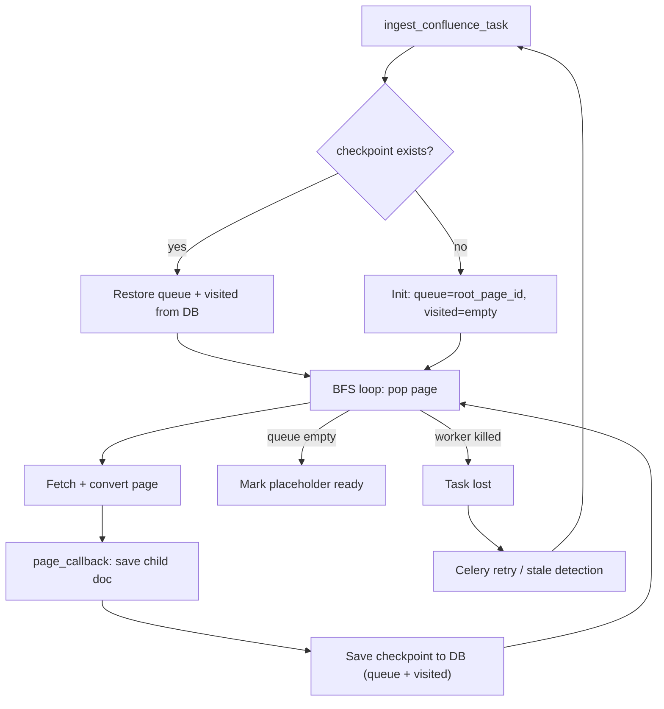

# Confluence Crawl Checkpoint (resumable crawling)

## Problem

The Confluence crawler runs inside a single Celery task `ingest_confluence_task`.
The BFS queue (`queue`) and the set of visited pages (`visited`) are stored
**only in memory**. If the worker restarts (deploy, OOM, crash), the task is
lost. Already-processed child pages are safely persisted, but unprocessed
page IDs from the BFS queue are gone.

## Solution

Persist a checkpoint (queue + visited + counters) in a JSONB field on the
placeholder Document after every processed page. On task start, restore the
checkpoint if it exists and resume from where the crawl left off.



## Affected files

| File | Change |
|------|--------|
| `backend/app/models.py` | Add `crawl_checkpoint` JSONB field to Document |
| `backend/db/schema.sql` | `ALTER TABLE documents ADD COLUMN IF NOT EXISTS crawl_checkpoint JSONB` |
| `backend/app/ingestion/converters/confluence.py` | Accept `initial_queue`/`initial_visited` params; expose current BFS state in callback |
| `backend/app/celery_app.py` | Load/save checkpoint in `ingest_confluence_task` |

## Implementation details

### 1. New field `crawl_checkpoint` on Document

```python
crawl_checkpoint: Mapped[dict | None] = mapped_column(JSONB, nullable=True)
```

Checkpoint format:

```json
{
  "queue": [["page_id_1", 2], ["page_id_2", 3]],
  "visited": ["root_id", "page_id_A", "page_id_B"],
  "dispatched": 109,
  "skipped": 5,
  "errors": 0,
  "pages_total": 143
}
```

### 2. Changes to `crawl_confluence()`

Add two optional parameters:

- `initial_queue: list[tuple[str, int]] | None` — restored BFS queue
- `initial_visited: set[str] | None` — already-visited page IDs

When provided, use them instead of the default `[(root_page_id, 0)]` / `set()`.

Extend the callback interface: after each processed page, pass the current
`queue` and `visited` snapshots so the caller can persist them. The simplest
approach is to add a `checkpoint_callback(queue, visited)` called right after
`page_callback`.

### 3. Save checkpoint in `_on_page` (celery_app.py)

In the `_on_page` progress-update section (where `progress_stage` is already
written), also write the checkpoint:

```python
ph.crawl_checkpoint = {
    "queue": [[pid, d] for pid, d in current_queue],
    "visited": list(current_visited),
    "dispatched": dispatched,
    "skipped": skipped,
    "errors": errors,
    "pages_total": pages_total,
}
```

This reuses the existing DB session and commit that already runs on every page.

### 4. Restore on task start

At the beginning of `ingest_confluence_task`:

1. Read `placeholder.crawl_checkpoint`
2. If not None — restore `dispatched`, `skipped`, `errors`, `pages_total` counters and pass `initial_queue`/`initial_visited` to `crawl_confluence()`
3. On **final** completion (status=ready or error) — clear `crawl_checkpoint = None`

### 5. Deduplication of already-processed pages

Already implemented: `_on_page` checks `source_hash` — if a child document
with that hash already exists, the page is skipped (`skipped += 1`). This
means no duplicates even if `visited` is lost between restarts.

### 6. Checkpoint write frequency

Write on **every page** — the JSONB payload is ~5-50 KB, and the UPDATE is
piggy-backed onto the existing `progress_stage` write. Negligible overhead.

## Out of scope

- Checkpoint for `ingest_single_url_task` (single page, not needed)
- Checkpoint for `ingest_document_task` (file pipeline, atomic)
- Automatic restart of lost tasks (separate feature; `check_stale_documents` resets to error, user can click "reingest")
