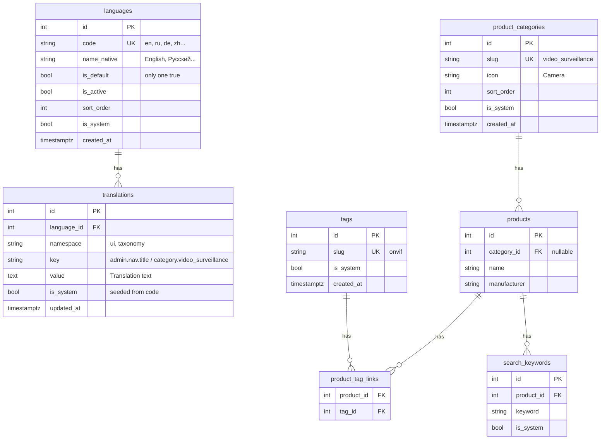
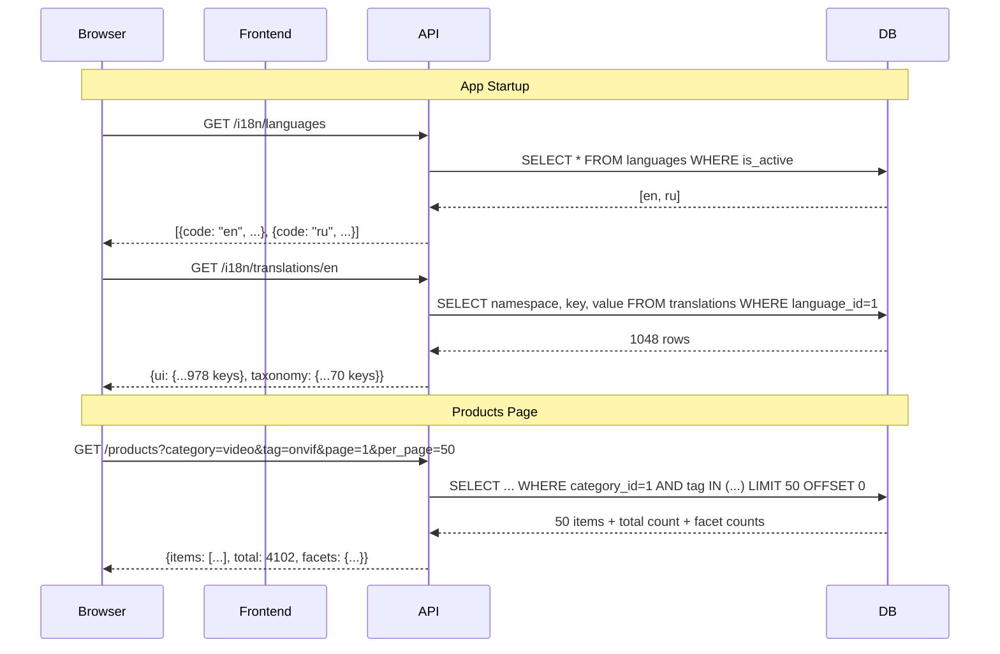
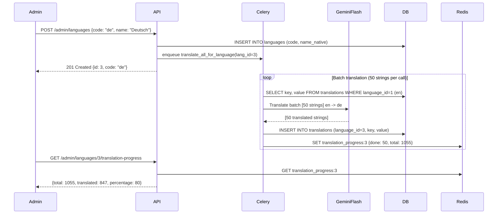

# Product Taxonomy + Full i18n System

## Architecture Overview

Three major subsystems built together:

1. **i18n Engine** -- languages reference table + translations in DB for all UI strings (~978 keys) and dynamic content (categories, tags). Replaces static en.json/ru.json with server-loaded translations. Supports up to 35 languages.
2. **Product Taxonomy** -- categories, tags, search keywords with DB-backed reference tables, code-based seeding, admin CRUD.
3. **Product Catalog** -- server-side pagination, faceted filtering, sidebar layout for 10,000+ products.



---

## Implementation Tasks

| # | ID | Task |
|---|---|---|
| 1 | db-migration | Create `006_i18n_and_taxonomy.sql`: languages, translations, product_categories, tags, product_tag_links, search_keywords tables + indexes + category_id on products |
| 2 | models | Add SQLAlchemy models: Language, Translation, ProductCategory, Tag, ProductTagLink, SearchKeyword. Update Product with category_id FK. |
| 3 | seed-i18n | `seed_i18n.py`: seed_languages() for en+ru, seed_ui_translations() importing 978 keys from en.json/ru.json into DB, called in lifespan |
| 4 | seed-taxonomy | `seed_taxonomy.py`: 7 categories, 70 tags, taxonomy translations, search keywords. Upsert on startup. |
| 5 | auto-translate | `backend/app/i18n/translator.py`: auto_translate() via Gemini Flash. Celery task translate_all_for_language(). Batch 50 strings/call. |
| 6 | i18n-api | GET /i18n/languages (public), GET /i18n/translations/{lang} (public, cacheable), GET /i18n/translations/{lang}/version |
| 7 | i18n-admin-api | Admin CRUD: languages (with auto-translate trigger), translations (paginated, bulk upsert, auto-translate missing, export/import JSON) |
| 8 | taxonomy-admin-api | Admin CRUD for categories, tags, search_keywords under /api/v1/admin/taxonomy. Labels via translations table. |
| 9 | products-api-paginated | Rewrite GET /products: server-side pagination, filtering (?category, ?tag, ?manufacturer, ?format, ?status, ?q), sorting. Add GET /products/facets. |
| 10 | products-api-taxonomy | GET /products/categories, GET /products/tags (public with counts). Extend PATCH for category_id + tag_ids. |
| 11 | search-boost | Query-time expansion of search_keywords in search_documents() for BM25 boost. |
| 12 | frontend-i18n | Replace static JSON imports with i18next-http-backend loading from /api/v1/i18n/translations/{lng}. LanguageToggle -> dropdown for 3+ languages. |
| 13 | admin-languages-page | New admin page /app/admin/languages: CRUD, active/inactive toggle, translation progress bar, auto-translate trigger on add. |
| 14 | admin-translations-page | New admin page /app/admin/translations: filter by lang/namespace/search, inline edit, missing highlights, per-row and bulk auto-translate, export/import. |
| 15 | admin-taxonomy-page | New admin page /app/admin/taxonomy: categories + tags tabs with per-language label editing + auto-translate, search keywords sub-tab. |
| 16 | frontend-types | TS types: PaginatedProducts, Facets, FacetValue, Language, Translation. API client functions. |
| 17 | sidebar-filters | Build FilterSidebar, FacetSection, ActiveFilters, Pagination, MobileFilterSheet components. |
| 18 | products-page | Rewrite ProductsPage: 2-column layout (sidebar + paginated table), URL sync, mobile bottom sheet. |
| 19 | edit-dialog | Category dropdown + tag autocomplete in ProductEditDialog, FileUpload, UrlImport with translated labels. |
| 20 | product-picker | Category tabs + server-side search in ProductPicker for 10k+ products. |
| 21 | localization | All new UI strings added to seed data (not JSON files). Admin nav items, filter labels, pagination text. |

---

## Phase 1: i18n Engine (DB-backed translations)

### 1.1 Database Tables

New migration `006_i18n_and_taxonomy.sql`:

```sql
-- Languages reference table
CREATE TABLE IF NOT EXISTS languages (
    id SERIAL PRIMARY KEY,
    code VARCHAR(10) NOT NULL UNIQUE,
    name_native TEXT NOT NULL,
    is_default BOOLEAN NOT NULL DEFAULT FALSE,
    is_active BOOLEAN NOT NULL DEFAULT TRUE,
    sort_order INT NOT NULL DEFAULT 0,
    is_system BOOLEAN NOT NULL DEFAULT FALSE,
    created_at TIMESTAMPTZ DEFAULT NOW()
);

-- Translations table (unified for UI strings + taxonomy labels)
CREATE TABLE IF NOT EXISTS translations (
    id SERIAL PRIMARY KEY,
    language_id INT NOT NULL REFERENCES languages(id) ON DELETE CASCADE,
    namespace VARCHAR(50) NOT NULL DEFAULT 'ui',
    key TEXT NOT NULL,
    value TEXT NOT NULL,
    is_system BOOLEAN NOT NULL DEFAULT FALSE,
    updated_at TIMESTAMPTZ DEFAULT NOW(),
    UNIQUE(language_id, namespace, key)
);

CREATE INDEX IF NOT EXISTS idx_translations_lookup
    ON translations(language_id, namespace);
CREATE INDEX IF NOT EXISTS idx_translations_key
    ON translations(namespace, key);
```

**Namespaces:**
- `ui` -- all ~978 current UI strings (from en.json/ru.json). Keys keep existing dot-notation: `admin.nav.title`, `chat.sources`, etc.
- `taxonomy` -- category/tag labels. Keys: `category.<slug>`, `tag.<slug>`.

### 1.2 SQLAlchemy Models

In `backend/app/models.py`:

```python
class Language(Base):
    __tablename__ = "languages"
    id, code, name_native, is_default, is_active, sort_order, is_system, created_at

class Translation(Base):
    __tablename__ = "translations"
    id, language_id (FK), namespace, key, value, is_system, updated_at
```

### 1.3 Seed Data

New file: `backend/app/admin/seed_i18n.py`

**seed_languages()**: Insert en (is_default=True) + ru. Upsert on code.

**seed_ui_translations()**: Parse existing en.json and ru.json programmatically (import as dicts), insert each key-value pair into `translations` table with `namespace='ui'`, `is_system=True`. Upsert on `(language_id, namespace, key)` -- only update if `is_system=True` (preserve admin edits).

**seed_taxonomy_translations()**: Insert labels for categories and tags with `namespace='taxonomy'`, keys like `category.video_surveillance`, `tag.onvif`.

Called in `main.py` lifespan after `seed_prompts()`.

### 1.4 Translation API

New router: `backend/app/i18n/router.py`, mounted at `/api/v1/i18n`

- `GET /i18n/languages` -- public, returns active languages list: `[{code, name_native, is_default}]`
- `GET /i18n/translations/{lang_code}` -- public, returns all translations for a language: `{namespace: {key: value}}`. Response is **cacheable** (ETag or Last-Modified header).
  - Optional query: `?ns=ui` to fetch only one namespace
  - Response shape: `{ "ui": { "admin.nav.title": "Admin", ... }, "taxonomy": { "category.video_surveillance": "Video Surveillance", ... } }`
- `GET /i18n/translations/{lang_code}/version` -- returns hash/timestamp for cache invalidation (frontend polls this to detect changes)

### 1.5 Auto-Translation via Gemini Flash

When a new language is added, or when new translation keys are created (e.g., new category/tag), missing translations are auto-generated using **Gemini 2.5 Flash** via the OpenAI-compatible API already configured in the project (`settings.openai_base_url`, `settings.gemini_api_key`).

**New service: `backend/app/i18n/translator.py`**

```python
async def auto_translate(
    source_lang: str,       # "en"
    target_lang: str,       # "de"
    entries: list[dict],    # [{"key": "admin.nav.title", "value": "Admin Panel"}]
    namespace: str = "ui",  # "ui" or "taxonomy"
) -> list[dict]:            # [{"key": "admin.nav.title", "value": "Admin-Panel"}]
```

- Uses `gemini-2.5-flash` (same as classifier, reranker, OCR -- cheap and fast)
- Sends batches of up to 50 strings per API call to minimize requests
- Prompt includes: source language, target language, context hint (namespace), instruction to preserve `{{variables}}` and HTML tags
- Returns translated strings; caller writes to `translations` table

**Trigger points:**

1. **`POST /admin/languages`** (add new language) -- after creating the language row, enqueue a Celery task `translate_all_for_language(language_id)` that:
   - Fetches all keys from the default language (en)
   - Batches them (50 per call) through `auto_translate()`
   - Inserts results into `translations` with `is_system=False` (admin can edit)
   - Fires progress updates via SSE or polling endpoint: `GET /admin/languages/:id/translation-progress`

2. **Creating new category/tag** (via admin taxonomy API) -- after inserting the default-language label, auto-translate to all active languages missing that key.

3. **Adding new UI keys via seed** (deployment) -- `seed_ui_translations()` detects keys that exist in en/ru but not in other active languages, enqueues translation task.

4. **Manual trigger**: `POST /admin/translations/auto-translate` -- admin selects source language, target language, and namespace; translates all missing keys.

**Celery task:** `backend/app/tasks/translate.py`

```python
@celery_app.task(bind=True, max_retries=3)
def translate_all_for_language(self, language_id: int):
    """Auto-translate all missing keys for a newly added language."""
    # 1. Fetch default-language translations (source)
    # 2. Fetch existing translations for target language
    # 3. Find missing keys
    # 4. Batch translate via auto_translate()
    # 5. Bulk insert into translations table
    # 6. Update progress in Redis (for polling)
```

**Cost estimate:** ~978 UI keys + ~77 taxonomy keys = ~1055 strings. At Gemini Flash pricing (~$0.075/1M input tokens), translating 1055 short strings to one language costs < $0.01. Even 35 languages = < $0.35 total.

**Configuration:**

New settings in `config.py`:
- `auto_translate_enabled: bool = True`
- `auto_translate_model: str = "gemini-2.5-flash"`
- `auto_translate_batch_size: int = 50`

### 1.6 Admin Translation API

In the admin router (`backend/app/admin/router.py`):

- `GET /admin/languages` -- full list with is_system, translation counts, translation progress
- `POST /admin/languages` -- add new language `{code, name_native}`. **Triggers auto-translation Celery task.**
- `PATCH /admin/languages/:id` -- update name, is_active, sort_order
- `DELETE /admin/languages/:id` -- block if is_system, cascade translations
- `GET /admin/languages/:id/translation-progress` -- returns `{total, translated, in_progress, percentage}`
- `GET /admin/translations?lang=en&ns=ui&q=search` -- paginated list of translations with search
- `PUT /admin/translations` -- bulk upsert: `[{lang_code, namespace, key, value}]`
- `POST /admin/translations/auto-translate` -- manual trigger: `{source_lang, target_lang, namespace?, keys?[]}`
- `POST /admin/translations/export` -- export all translations as JSON (for backup)
- `POST /admin/translations/import` -- import translations from JSON

### 1.7 Frontend i18n Migration

Replace static JSON imports with server-loaded translations.

**Changes to `frontend/src/i18n.ts`:**

- Remove static `import en from './locales/en.json'` and `import ru from './locales/ru.json'`
- Use `i18next-http-backend` plugin to load translations from `GET /api/v1/i18n/translations/{lng}`
- Configure: `backend: { loadPath: '/api/v1/i18n/translations/{{lng}}' }`
- Keep `fallbackLng: 'en'`, `LanguageDetector` with localStorage
- Add `partialBundledLanguages: true` with minimal fallback bundle (critical strings like "Loading...") hardcoded for SSR/initial render

**Changes to `frontend/src/components/LanguageToggle.tsx`:**

- Fetch available languages from `GET /api/v1/i18n/languages` on mount
- Render dropdown (not just toggle) when > 2 languages active
- Still toggle for 2 languages (backward compatible)

**Static files en.json / ru.json:**
- Keep as **fallback only** during transition (embedded in build)
- Once stable, remove from build and rely entirely on API

---

## Phase 2: Product Taxonomy

### 2.1 Database Tables

In the same migration `006_i18n_and_taxonomy.sql`:

```sql
-- Product categories
CREATE TABLE IF NOT EXISTS product_categories (
    id SERIAL PRIMARY KEY,
    slug VARCHAR(100) NOT NULL UNIQUE,
    icon VARCHAR(50) DEFAULT '',
    sort_order INT NOT NULL DEFAULT 0,
    is_system BOOLEAN NOT NULL DEFAULT FALSE,
    created_at TIMESTAMPTZ DEFAULT NOW()
);

-- Tags
CREATE TABLE IF NOT EXISTS tags (
    id SERIAL PRIMARY KEY,
    slug VARCHAR(100) NOT NULL UNIQUE,
    is_system BOOLEAN NOT NULL DEFAULT FALSE,
    created_at TIMESTAMPTZ DEFAULT NOW()
);

-- Product <-> Tag many-to-many
CREATE TABLE IF NOT EXISTS product_tag_links (
    product_id INT NOT NULL REFERENCES products(id) ON DELETE CASCADE,
    tag_id INT NOT NULL REFERENCES tags(id) ON DELETE CASCADE,
    PRIMARY KEY (product_id, tag_id)
);

-- Search keywords per product (for BM25 boost)
CREATE TABLE IF NOT EXISTS search_keywords (
    id SERIAL PRIMARY KEY,
    product_id INT NOT NULL REFERENCES products(id) ON DELETE CASCADE,
    keyword TEXT NOT NULL,
    is_system BOOLEAN NOT NULL DEFAULT FALSE
);

-- Add category_id to products
ALTER TABLE products ADD COLUMN IF NOT EXISTS category_id INT REFERENCES product_categories(id);
CREATE INDEX IF NOT EXISTS idx_products_category_id ON products(category_id);
CREATE INDEX IF NOT EXISTS idx_search_keywords_product ON search_keywords(product_id);
CREATE INDEX IF NOT EXISTS idx_product_tag_links_tag ON product_tag_links(tag_id);
```

**No label columns on categories/tags** -- all labels live in `translations` table with `namespace='taxonomy'`.

### 2.2 SQLAlchemy Models

In `backend/app/models.py`:

```python
class ProductCategory(Base):
    __tablename__ = "product_categories"
    id, slug, icon, sort_order, is_system, created_at

class Tag(Base):
    __tablename__ = "tags"
    id, slug, is_system, created_at

class ProductTagLink(Base):
    __tablename__ = "product_tag_links"
    product_id, tag_id  (composite PK)

class SearchKeyword(Base):
    __tablename__ = "search_keywords"
    id, product_id, keyword, is_system
```

Update `Product` model: add `category_id = mapped_column(ForeignKey("product_categories.id"), nullable=True)`.

### 2.3 Seed Data

`seed_taxonomy()` in `backend/app/admin/seed_taxonomy.py`:

- 7 categories (video_surveillance, access_control, intercom, protocols, software, building_automation, alarm_intrusion)
- 70 tags (onvif, rtsp, h264, osdp, sip, bacnet, ptz, edge-ai, lpr, etc.)
- Category/tag labels seeded into `translations` table with `namespace='taxonomy'`
- Search keyword examples for Tier A products

Upsert pattern: `INSERT ... ON CONFLICT (slug) DO UPDATE SET icon=..., sort_order=... WHERE is_system=TRUE`

### 2.4 Taxonomy Admin API

New router: `backend/app/admin/taxonomy_router.py`, mounted via admin router at `/api/v1/admin/taxonomy`

- **Categories**: `GET`, `POST`, `PATCH /:id`, `DELETE /:id`
  - POST/PATCH accept: `{slug, icon, sort_order, labels: {en: "...", ru: "...", de: "..."}}`
  - Backend writes/updates corresponding rows in `translations` table
  - DELETE blocked if products are assigned
- **Tags**: `GET`, `POST`, `PATCH /:id`, `DELETE /:id`
  - Same pattern: labels via translations table
  - DELETE cascades product_tag_links
- **Search Keywords**: `GET ?product_id=...`, `POST`, `DELETE /:id`

### 2.5 Public Taxonomy API

In `backend/app/products/router.py`:

- `GET /products/categories` -- returns categories with product counts + labels for requested language (Accept-Language header)
- `GET /products/tags` -- returns tags with product counts + labels
- `PATCH /products/:m/:p` -- extend with `category_id` and `tag_ids: list[int]`

---

## Phase 3: Server-Side Paginated Product Catalog

### 3.1 Products API Rewrite

**Target scale: 10,000+ products.**

Rewrite `GET /products` in `backend/app/products/router.py`:

- **Pagination**: `?page=1&per_page=50` (default 50, max 100)
- **Filters**: `?category=<slug>&tag=<slug>&tag=<slug>&manufacturer=<name>&format=<fmt>&status=<status>&q=<text>`
- **Sorting**: `?sort=name&order=asc` (columns: name, created_at, total_documents, total_chunks)
- **Response**: `{ items: ProductListItem[], total: int, page: int, per_page: int, facets: Facets }`

`GET /products/facets` -- facet counts for sidebar, accepts same filter params, cross-facet counting:
`{ categories: [{slug, label, count}], tags: [{slug, label, count}], manufacturers: [{name, count}], formats: [{format, count}], statuses: [{status, count}] }`

### 3.2 Frontend: Sidebar Filters Layout

Rewrite `frontend/src/pages/ProductsPage.tsx` to 2-column layout:

**Left sidebar (240px, collapsible on mobile):**
- Categories -- radio buttons (single select), counts from facets
- Tags -- checkboxes (multi-select AND), top-10 + search + "Show all N"
- Manufacturer -- checkboxes, top-10 + search + "Show all N"
- Format -- checkboxes
- Status -- checkboxes

**Main content:**
- Active filters as dismissible pills + "Clear all"
- Data table with server-side sorting
- Pagination bar (page nav + "Showing X-Y of Z")

**Mobile (< 768px):**
- Sidebar becomes "Filters (N)" button -> full-screen bottom sheet
- Cards layout instead of table

**New components:**
- `FilterSidebar.tsx` -- sidebar container
- `FacetSection.tsx` -- reusable filter section (label, search, checkboxes, expand)
- `ActiveFilters.tsx` -- dismissible pills
- `Pagination.tsx` -- page navigation
- `MobileFilterSheet.tsx` -- bottom sheet for mobile

**URL sync:** `/app/products?category=video&tag=onvif&tag=ptz&manufacturer=hikvision&page=2`

---

## Phase 4: Admin UI + Integration

### 4.1 Languages Admin Page

New page: `frontend/src/pages/admin/LanguagesPage.tsx`, route: `/app/admin/languages`

- Table: code, name_native, is_default badge, is_active toggle, is_system badge, sort_order, **translation progress bar** (e.g., "847/1055 -- 80%")
- **Add language dialog:**
  - Language code input (with autocomplete from ISO 639-1 list)
  - Native name input (auto-filled from ISO data, e.g., "de" -> "Deutsch")
  - Checkbox: "Auto-translate from English" (checked by default)
  - On submit: creates language + triggers Celery auto-translate task
  - Progress bar appears in table, updates via polling `GET /admin/languages/:id/translation-progress`
- Toggle active/inactive
- Cannot delete system languages (en, ru)
- **"Translate missing" button** per language row -- triggers `POST /admin/translations/auto-translate` for that language, fills in any keys that were added since the initial translation

### 4.2 Translations Admin Page

New page: `frontend/src/pages/admin/TranslationsPage.tsx`, route: `/app/admin/translations`

- Filter by: language, namespace (ui / taxonomy), search by key or value
- Table: key, source value (default language, read-only), translated value (editable inline), is_system badge
- **Missing translations highlighted** in red (key exists for default language but not for selected) with one-click "Auto-translate" button per row
- **Bulk actions:**
  - Select multiple keys -> "Auto-translate selected" (sends to Gemini Flash)
  - Select multiple keys -> edit value for specific language
- "Auto-translate all missing" button in toolbar -- fills all gaps for selected language via Gemini
- Export/Import buttons (JSON)

### 4.3 Taxonomy Admin Page

New page: `frontend/src/pages/admin/TaxonomyPage.tsx`, route: `/app/admin/taxonomy`

Two tabs: Categories, Tags

**Categories tab:**
- Table: slug, labels (expandable row showing all language values), icon, sort_order, product count, is_system
- Add/edit modal with: slug, icon, sort_order + dynamic label fields for each active language
- Default language label is required, others auto-translated via Gemini if left empty
- Checkbox in modal: "Auto-translate to other languages" (checked by default)
- Drag to reorder

**Tags tab:**
- Table: slug, labels, product count, is_system
- Add/edit modal with: slug + label fields per active language
- Default language required, others auto-translated if left empty
- Bulk merge (combine two tags)

**Search Keywords tab (or sub-page):**
- Filter by product
- Table: keyword, product name, is_system
- Add/delete

### 4.4 ProductEditDialog / FileUpload / UrlImport

- Category: `<select>` dropdown with translated labels
- Tags: multi-select autocomplete with translated labels

### 4.5 ProductPicker (Chat)

- Category tabs/pills with server-side filtering
- Server-side search (not load all 10k products)

### 4.6 Search Keywords Integration

Query-time expansion in `backend/app/search/service.py` `search_documents()`:
- Before BM25 query, fetch keywords for target product(s)
- Append to search query text for broader matching
- No trigger changes, no chunk reindex needed

---

## Migration Strategy

1. Deploy migration `006_i18n_and_taxonomy.sql` (creates all tables)
2. `seed_languages()` creates en + ru
3. `seed_ui_translations()` imports all 978 keys from en.json and ru.json into translations table
4. `seed_taxonomy()` creates categories, tags, taxonomy translations
5. Frontend switches from static JSON to API-loaded translations (with JSON fallback)
6. One-time: map existing free-text `category` column on products to `category_id`
7. Old `category` text column kept for backward compat, deprecated

---

## Data Flow



---

## Auto-Translation Flow


