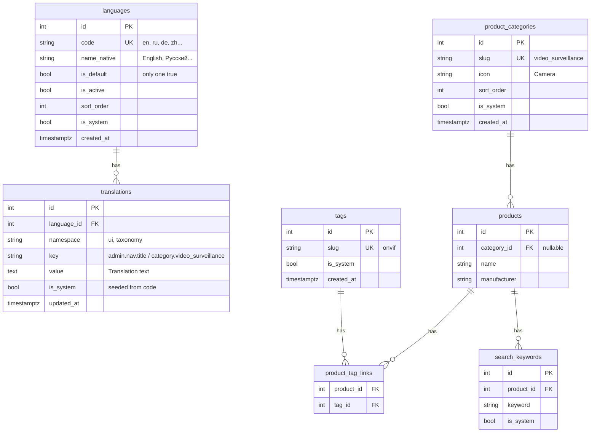
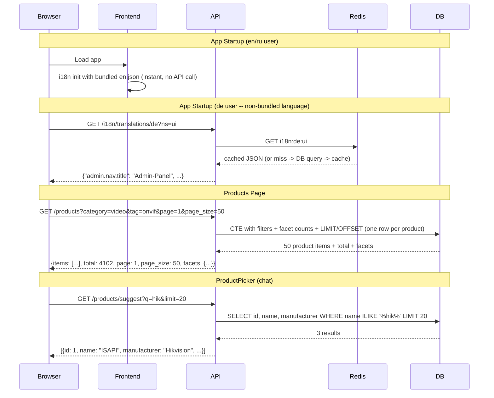
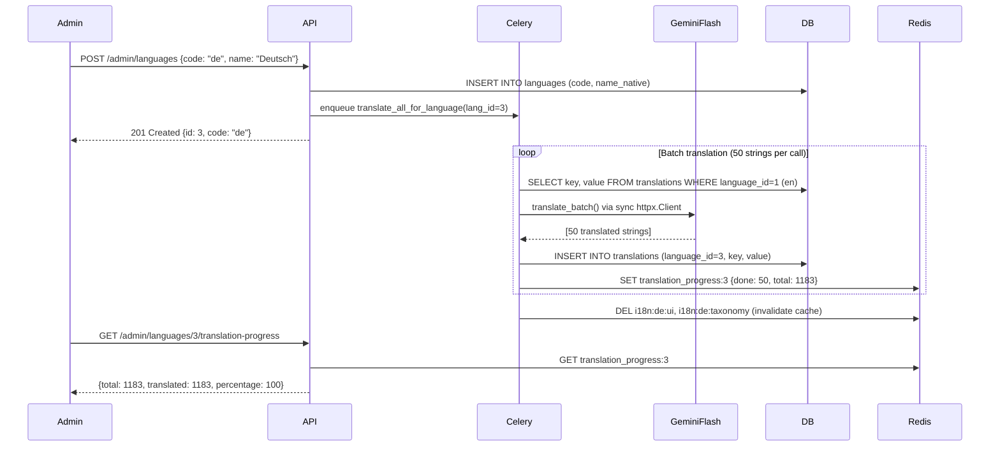

# Product Taxonomy + Full i18n System

## Architecture Overview

Three major subsystems built together:

1. **i18n Engine** -- languages reference table + translations in DB for all UI strings (~1106 keys after sync + new) and dynamic content (categories, tags). Replaces static en.json/ru.json with server-loaded translations. Supports up to 35 languages. Auto-translation via Gemini Flash.
2. **Product Taxonomy** -- categories, tags, search keywords with DB-backed reference tables, code-based seeding, admin CRUD.
3. **Product Catalog** -- server-side pagination, faceted filtering, sidebar layout for 10,000+ products.

**Design decisions:**
- Taxonomy and languages are **tenant-agnostic** (shared across all tenants). Categories, tags, and languages are global platform resources. Products have `tenant_id` but reference shared categories/tags.
- `en.json` and `ru.json` remain in the repo as **source of truth** for system languages. They are used by seed, by tests, and as embedded fallback in the frontend bundle. The DB is populated from them, not the other way around.



---

## Implementation Tasks

| # | ID | Task |
|---|---|---|
| 1 | db-migration | Create `006_i18n_and_taxonomy.sql`: all tables + indexes + `UNIQUE(product_id,keyword)` + `ON DELETE SET NULL` on category_id + pg_trgm indexes. Add `CREATE EXTENSION pg_trgm` to `schema.sql`. |
| 2 | models | Add SQLAlchemy models: Language, Translation, ProductCategory, Tag, ProductTagLink, SearchKeyword. Update Product with category_id FK. |
| 3 | seed-i18n | `seed_i18n.py`: seed_languages() for en+ru, seed_ui_translations() with version-hash skip, bulk insert. Called in `main.py` lifespan after `seed_prompts()`. |
| 4 | seed-taxonomy | `seed_taxonomy.py`: 7 categories, 70 tags, taxonomy translations, search keywords. Upsert on startup. |
| 5 | auto-translate | `translator.py`: sync `translate_batch()` via `httpx.Client`. Celery task + `translation` queue. Update `docker-compose.yml` worker command + env vars. Add `AUTO_TRANSLATE_*` to `config.py`. |
| 6 | i18n-api | Public i18n router (NO auth, like share_public_router). `GET /i18n/languages`, `GET /i18n/translations/{lang}?ns=` (Redis-cached, ETag), `GET .../version`. Mount in `main.py` without `_auth`. |
| 7 | i18n-admin-api | Admin CRUD: languages (with auto-translate trigger), translations (paginated, bulk upsert, auto-translate missing, export/import JSON) |
| 8 | taxonomy-admin-api | Admin CRUD for categories (ON DELETE SET NULL + is_system guard), tags, search_keywords under /api/v1/admin/taxonomy. Labels via translations table. |
| 9 | products-api-paginated | Rewrite GET /products: one row per product (firmware_versions nested), paginated + filtered, facets in same CTE. Add GET /products/suggest (with firmware_versions). `page_size` field. |
| 10 | products-api-taxonomy | GET /products/categories, GET /products/tags (public with counts). Extend PATCH for category_id + tag_ids. |
| 11 | search-boost | Query-time expansion of search_keywords via OR-joined `to_tsquery`. Only when product_id filter active. Boost via `ts_rank`, not WHERE. |
| 12 | frontend-i18n | i18next-http-backend for non-system languages. en/ru stay bundled. Suspense loading screen. LanguageToggle -> dropdown. |
| 13 | admin-languages-page | New admin page /app/admin/languages: CRUD, active/inactive toggle, translation progress bar, auto-translate trigger on add. |
| 14 | admin-translations-page | New admin page /app/admin/translations: filter by lang/namespace/search, inline edit, missing highlights, per-row and bulk auto-translate, export/import. |
| 15 | admin-taxonomy-page | New admin page /app/admin/taxonomy: categories + tags tabs with per-language label editing + auto-translate, search keywords sub-tab. |
| 16 | frontend-types | TS types: PaginatedProducts, Facets, FacetValue, Language, Translation. API client functions. Update listProducts() signature. |
| 17 | sidebar-filters | Build FilterSidebar, FacetSection, ActiveFilters, Pagination, MobileFilterSheet components. |
| 18 | products-page | Rewrite ProductsPage: 2-column layout, server-side data flow (no useDataTable), URL sync, mobile bottom sheet. |
| 19 | edit-dialog | Category dropdown + tag autocomplete in ProductEditDialog, FileUpload, UrlImport with translated labels. |
| 20 | product-picker | Category tabs + server-side search via GET /products/suggest in ProductPicker and ProductAutocomplete. |
| 21 | localization | Sync 32 missing keys en↔ru. Add ~96 new UI strings to en.json + ru.json. Admin nav items, filter labels, pagination, empty/error states. |
| 22 | update-tests | Update frontend tests: mock i18n API for integration tests, keep JSON-based setup.ts for unit tests. |
| 23 | mcp-update | Update `tool_list_products` in MCP server to use category_id/slug, tags, and search_keywords instead of deprecated text category column. |
| 24 | data-migration | Script to map existing `products.category` (free text) to `products.category_id` (FK). Mapping table + one-shot migration. |
| 25 | translate-error-handling | Error handling in translate_batch(): validate response count, partial commit per batch, retry with exponential backoff, dead letter for unrecoverable errors. |
| 26 | frontend-infra | Create `useDebounce` hook, extract reusable `SearchInput`, `Pagination`, `ProgressBar` components. Organize new files into `components/filters/`, `components/admin/`. |
| 27 | admin-routing | Add 3 Routes to `AdminApp.tsx` + 3 entries in `ADMIN_SUB_NAV` (Layout.tsx) with icons. Lazy-load heavy admin pages (TranslationsPage). |
| 28 | api-client-files | Create `api/i18n.ts`, `api/admin-i18n.ts`, `api/admin-taxonomy.ts` with ~25 new API functions. Update `updateProduct()` signature. |

---

## Known Risks and Mitigations

### Risk 1: GET /products response shape change breaks 4 consumers
**Current:** `GET /products` returns `ProductListItem[]` (flat array).
**New:** Returns `{ items, total, page, page_size, facets }`.
**Affected:** `ProductsPage`, `ProductPicker`, `ProductAutocomplete`, `products.test.ts`.
**Mitigation:** All 4 consumers updated atomically in single deploy. `listProducts()` in `api/products.ts` updated to new signature. `ProductPicker` and `ProductAutocomplete` switch to new `GET /products/suggest` endpoint (see 3.1).

### Risk 2: ProductPicker / ProductAutocomplete need full-text search, not pagination
**Mitigation:** New lightweight endpoint `GET /products/suggest?q=hik&limit=20` returns `[{id, name, manufacturer, slug, manufacturer_slug, category_slug, firmware_versions: [{id, version}]}]`. No aggregations, no facets, no document stats -- fast. Used by ProductPicker, ProductAutocomplete, and chat product detection.

### Risk 3: First render FOUC when translations loaded from API
**Mitigation:** en.json and ru.json stay **bundled** in the frontend build as `partialBundledLanguages`. Only non-system languages (3rd+) are loaded from API. For en/ru, translations are instant (from bundle) and overridden by API response if newer. `React.Suspense` wrapper with branded loading screen for async language loading.

### Risk 4: useDataTable is client-side only, cannot support server pagination
**Mitigation:** ProductsPage will **not use** `useDataTable`. Instead, a new `useServerTable` pattern: filter/sort/page state in URL params -> `useEffect` triggers API call -> renders table directly. `useDataTable` remains for other pages (Documents, Admin) where data fits in memory.

### Risk 5: Celery task uses async auto_translate() but worker is sync
**Mitigation:** `translator.py` provides **sync** `translate_batch()` using `httpx.Client` (not async). Same pattern as sync DB access in existing Celery tasks. No `asyncio.run_until_complete` needed. Task added to `celery_app.py` alongside existing tasks (no separate `tasks/` directory).

### Risk 6: Seed runs ~2366 upserts at startup, grows to ~41k with 35 languages
**Mitigation:** Seed only system languages (en, ru) -- ~2366 upserts (1183 strings × 2 languages). Other languages' translations created via Celery auto-translate task, not at startup. Version-hash check: compute MD5 of en.json content, compare with stored hash in Redis. If unchanged, skip seed entirely. Typical cold start: <2s for seed (bulk insert); warm start with unchanged JSON: <50ms (hash check only).

### Risk 7: i18n API response format incompatible with i18next-http-backend
**Mitigation:** `GET /i18n/translations/{lang}?ns=ui` returns **flat** `{ "key": "value" }` when `ns` param is specified (compatible with i18next-http-backend default parser). Without `ns`, returns `{ "ui": {...}, "taxonomy": {...} }` for admin use. Frontend config: `loadPath: '/api/v1/i18n/translations/{{lng}}?ns={{ns}}'` with i18next namespaces `['ui', 'taxonomy']`.

### Risk 8: No Redis cache for translation API -- unnecessary DB hits
**Mitigation:** `GET /i18n/translations/{lang}` cached in Redis with key `i18n:{lang}:{ns}`. TTL: infinite, invalidated on write (PUT translations, POST auto-translate, seed). ETag header derived from Redis key version counter. Typical response: ~60KB JSON for ~1183 keys, served from Redis in <5ms.

### Risk 9: Facet counts are expensive (5x COUNT GROUP BY on 10k rows)
**Mitigation:** Facets computed **in the same query** as product list (using window functions or CTEs), not as separate endpoint. Response: `{ items: [...], total: int, page: int, page_size: int, facets: {...} }`. For the initial load (no filters), facet counts cached in Redis for 60 seconds.

### Risk 10: Frontend tests depend on static JSON imports
**Mitigation:** `__tests__/setup.ts` continues to import en.json/ru.json directly (these files remain in repo). Unit tests unchanged. Integration tests that test i18n loading: mock `GET /i18n/translations/{lang}` via MSW or jest mock. `i18n.test.tsx` structure tests remain valid since JSON files are the source of truth.

### Risk 11: Taxonomy tables have no tenant_id
**By design:** Categories, tags, and languages are platform-global. All tenants share the same taxonomy. If per-tenant taxonomy needed in future, add `tenant_id` column + index. Current design: simpler, consistent catalog across tenants.

### Risk 12: Race condition -- seed and Celery translate running simultaneously
**Problem:** On deploy, `seed_ui_translations()` inserts keys for en/ru and enqueues `translate_missing_keys`. Meanwhile, a previous `translate_all_for_language()` task may still be running for a language the admin just added. Both write to `translations` table for the same `(language_id, namespace, key)`.
**Mitigation:**
- All translation INSERTs (both seed and auto-translate) use `INSERT ... ON CONFLICT (language_id, namespace, key) DO UPDATE SET value = EXCLUDED.value WHERE translations.is_system = FALSE`. This makes writes idempotent.
- Redis distributed lock `translate:{lang_id}` with TTL=700s (matches task time_limit). `translate_all_for_language()` acquires lock before starting; if lock exists, task retries after delay.
- Partial commits: after each batch of 50, commit to DB immediately. If task fails mid-way, already-translated strings are preserved. Retry picks up only missing keys.

### Risk 13: Gemini API errors during auto-translate
**Problem:** `translate_batch()` calls Gemini Flash which may return invalid JSON, truncated responses, 429 rate limit, or 500 errors.
**Mitigation:**
- **Response validation:** parse JSON, verify `len(output) == len(input)`. If mismatch, log warning and retry the batch.
- **Per-batch retry:** 3 retries with exponential backoff (2s, 4s, 8s) within `translate_batch()`, before propagating to Celery-level retry.
- **Partial commit:** each successful batch committed to DB immediately. Task failure only loses the current in-progress batch, not prior work.
- **Rate limit handling:** on 429, extract `Retry-After` header, sleep, retry. On persistent 429 (>3 retries), mark task as rate-limited in Redis progress, pause for 60s, continue.
- **Dead letter:** after Celery max_retries=3 exhausted, log failed keys to `translation_errors:{lang_id}` in Redis. Admin sees "N keys failed" in progress UI with option to retry.
- **Graceful degradation:** missing translations fall back to `fallbackLng` (en) on frontend -- users see English, not broken UI.

### Risk 14: MCP server tool_list_products uses deprecated category column
**Problem:** `backend/app/mcp/server.py` `tool_list_products()` filters by `p.category ILIKE :category` -- the free-text column. After migration, this column is deprecated; real categories are in `product_categories` table via `category_id` FK.
**Mitigation:** Task #23 -- update MCP tool to JOIN `product_categories` and filter by `pc.slug = :category`. Also integrate tags and search_keywords for better tool results.

### Risk 15: Language deletion during active auto-translate task
**Problem:** Admin deletes language while Celery `translate_all_for_language()` is running. CASCADE deletes already-inserted translations; next INSERT gets FK violation.
**Mitigation:** `DELETE /admin/languages/:id` sets `is_active = FALSE` instead of hard delete when `translate_all_for_language` task is in progress (check Redis lock). Celery task checks `is_active` at start of each batch -- graceful exit if deactivated. Hard delete only allowed when no task is running.

### Risk 16: Dynamic translation keys (t(`error.${code}`)) may miss new codes
**Mitigation:** Dynamic key patterns documented. Error codes, status values, stage names -- all enumerable. Seed must include all possible values. Missing key falls back to i18next `fallbackLng` (en, always bundled). Monitoring: log untranslated key access on frontend (i18next `missingKeyHandler`).

### Risk 17: Product×firmware_version granularity breaks facet counts and pagination
**Problem:** Current `GET /products` returns one row per (product, firmware_version). If a product has 3 versions, it counts as 3 in `total` and 3 in category facet -- semantically wrong. OFFSET/LIMIT paginates version pairs, not products.
**Mitigation:** Paginated `GET /products` returns **one row per product** with `firmware_versions: [{id, version}]` nested. Facets and `total` count unique products. See "Backend Fixes — Fix 1".

### Risk 18: Filter race conditions on rapid user interaction
**Problem:** User quickly clicks 3 filters -> 3 API requests. Response from request 1 may arrive after response 3, overwriting correct results with stale data.
**Mitigation:** AbortController in `listProducts()`. Each filter/page change aborts the previous in-flight request. Only the latest request's response updates the UI.

### Risk 19: No debounce on server-side text search (ProductsPage)
**Problem:** Without debounce, each keystroke fires an API request -> DDoS on own backend.
**Mitigation:** 300ms debounce on search input. New `useDebounce` hook (extracted from existing duplicate code in ChatAuditPage/LogsPage). Also used by ProductAutocomplete and admin search inputs.

### Risk 20: i18n namespace migration (translation -> ui)
**Problem:** Current i18next uses namespace `translation`. Plan uses `ui` + `taxonomy`. If misconfigured, all bundled translations stop working.
**Mitigation:** Single change in `i18n.ts`: `resources: { en: { ui: en }, ru: { ui: ru } }` + `defaultNS: 'ui'`. All existing `t('key')` calls unaffected because `t()` uses `defaultNS`. See "Backend Fixes — Fix 10".

### Risk 21: ~25 new API functions without file organization plan
**Problem:** Current `api/products.ts` is small (4 functions). Adding i18n and taxonomy admin APIs without structure leads to monolithic files.
**Mitigation:** Task #28: `api/i18n.ts` (public: languages, translations), `api/admin-i18n.ts` (admin CRUD for languages, translations, auto-translate triggers), `api/admin-taxonomy.ts` (admin CRUD for categories, tags, keywords). `api/products.ts` gets `suggestProducts()` + updated `listProducts()` signature.

### Risk 22: pagination field name inconsistency (per_page vs page_size)
**Problem:** Existing admin APIs use `page_size`. Plan initially used `per_page` -- confusing for frontend devs.
**Mitigation:** All paginated APIs standardized to `page_size`. See "Backend Fixes — Fix 11".

### Risk 23: Dark theme not addressed for new components
**Problem:** 30+ dark theme overrides in `globals.css`. New components without dark theme support will look broken for 50%+ of users.
**Mitigation:** All new components use only CSS variables. No hardcoded colors. Explicitly tested in both themes during implementation. CSS-only theme support -- no JS theme detection needed.

### Risk 24: Mobile bottom sheet is a new UX pattern not present in existing app
**Problem:** No existing bottom sheet component. Introducing unfamiliar pattern needs careful implementation.
**Mitigation:** Reuse existing animation keyframes (`confirm-slide-up`, `confirm-fade-in`). Implement as `MobileFilterSheet.tsx` with `role="dialog"`, `aria-modal="true"`, focus trap, backdrop blur. Height: 80vh with scroll. Close: X button, backdrop click, Escape key.

### Risk 25: BM25 search_keywords expansion — AND vs OR semantics
**Problem:** Current `_bm25_search()` uses `plainto_tsquery('simple', :query)` which joins all terms with AND. If search_keywords are naively concatenated to the user query, they would **narrow** results instead of broadening them. Also, without a product_id filter, pulling keywords for all products creates noise.
**Mitigation:** search_keywords expansion is only applied when `product_id` filter is active (chat product context). Keywords are appended as OR terms: `(user_query) | keyword1 | keyword2`. Use `to_tsquery('simple', ...)` with explicit OR operators instead of `plainto_tsquery`. Keyword matching boosts relevance, not filters — done via `ts_rank` weighting, not WHERE clause.

### Risk 26: Docker worker missing `translation` queue and env vars
**Problem:** Fix 6 describes adding `-Q celery,monitoring,translation` to worker, but it's not in the task list. Also, worker service env vars (`*worker-env`) do not include `OPENAI_BASE_URL` needed by `translator.py` via `httpx.Client`.
**Mitigation:**
- Task #5 (auto-translate) explicitly includes updating `docker-compose.yml` worker command and env vars.
- Add to worker env: `OPENAI_BASE_URL`, `GEMINI_API_KEY` (already present in api env via anchor). Add `AUTO_TRANSLATE_ENABLED`, `AUTO_TRANSLATE_MODEL`, `AUTO_TRANSLATE_BATCH_SIZE` to `config.py` with defaults.

### Risk 27: i18n public router mount — must be WITHOUT auth
**Problem:** All existing routers in `main.py` are mounted with `dependencies=_auth` or `dependencies=_admin_auth`. The i18n public router (`/api/v1/i18n/*`) must be public (no auth) for LanguageToggle to work for unauthenticated users and for i18next-http-backend to load translations.
**Mitigation:** Task #6 explicitly states: mount i18n_router with `app.include_router(i18n_router, prefix="/api/v1/i18n")` — NO dependencies. Same pattern as existing `share_public_router`. Lifespan updates (calling `seed_i18n()` and `seed_taxonomy()` after `seed_prompts()`) included in Task #3 scope.

### Risk 28: Category DELETE semantics and is_system protection
**Resolved:** DDL uses `ON DELETE SET NULL` on `products.category_id`. Deleting a category safely unlinks products (they become "uncategorized"). API-level protection: `is_system=TRUE` categories/tags return 403 on DELETE. Non-system categories: DELETE succeeds with `ON DELETE SET NULL`, UI shows "Warning: N products will lose this category" confirmation dialog before sending request.

### Risk 29: en.json and ru.json key desync (32 keys missing in en.json)
**Problem:** `ru.json` has 1010 keys, `en.json` has 978 keys. 32 keys related to debug/OCR/analytics exist only in Russian. Seed reads both files; missing English translations will fall back to the key name (e.g., `debug.rewriteCost`).
**Mitigation:** Pre-implementation task: sync en.json and ru.json — add all 32 missing English translations. This is a prerequisite for Task #3 (seed-i18n). Include in Task #21 (localization).

### Risk 30: Concurrent translation edits — last-write-wins
**Problem:** Two admins editing the same translation key simultaneously. No optimistic locking.
**Design decision:** Last-write-wins is acceptable for this use case. Translations are edited infrequently and conflicts are rare. `updated_at` column shown in UI provides visual cue. If conflicts become an issue, can add `If-Match: <etag>` header later. Not implementing optimistic locking in v1.

### Risk 31: pg_trgm extension requires superuser privileges
**Problem:** `CREATE EXTENSION IF NOT EXISTS pg_trgm` requires superuser. If run in migration file (by app user), it may fail.
**Mitigation:** Add `CREATE EXTENSION IF NOT EXISTS pg_trgm;` to `backend/db/schema.sql` (not `migrations/006...sql`). `schema.sql` runs during DB init as superuser. Alternatively, include in `006.sql` with a note that the DB user must have CREATEDB privilege, or pre-create the extension via init script.

### Risk 32: Accurate string count matters for seed performance and cost
**Resolved:** All estimates unified to **~1183 strings per language** (1106 UI + 77 taxonomy). Seed upserts: 1183 × 2 = ~2366 rows. Auto-translate per language: ~1183 strings. Cost: < $0.01/language. Bulk insert handles 2366 rows in <200ms.

---

## Phase 1: i18n Engine (DB-backed translations)

### 1.1 Database Tables

New migration `006_i18n_and_taxonomy.sql`:

```sql
-- Languages reference table
CREATE TABLE IF NOT EXISTS languages (
    id SERIAL PRIMARY KEY,
    code VARCHAR(10) NOT NULL UNIQUE,
    name_native TEXT NOT NULL,
    is_default BOOLEAN NOT NULL DEFAULT FALSE,
    is_active BOOLEAN NOT NULL DEFAULT TRUE,
    sort_order INT NOT NULL DEFAULT 0,
    is_system BOOLEAN NOT NULL DEFAULT FALSE,
    created_at TIMESTAMPTZ DEFAULT NOW()
);

-- Translations table (unified for UI strings + taxonomy labels)
CREATE TABLE IF NOT EXISTS translations (
    id SERIAL PRIMARY KEY,
    language_id INT NOT NULL REFERENCES languages(id) ON DELETE CASCADE,
    namespace VARCHAR(50) NOT NULL DEFAULT 'ui',
    key TEXT NOT NULL,
    value TEXT NOT NULL,
    is_system BOOLEAN NOT NULL DEFAULT FALSE,
    updated_at TIMESTAMPTZ DEFAULT NOW(),
    UNIQUE(language_id, namespace, key)
);

CREATE INDEX IF NOT EXISTS idx_translations_lookup
    ON translations(language_id, namespace);
CREATE INDEX IF NOT EXISTS idx_translations_key
    ON translations(namespace, key);
```

**Namespaces:**
- `ui` -- all ~1106 UI strings (978 from en.json + 32 synced missing keys + 96 new keys for sidebar/pagination/admin pages). Keys keep existing dot-notation: `admin.nav.title`, `chat.sources`, etc.
- `taxonomy` -- category/tag labels. Keys: `category.<slug>` (7) + `tag.<slug>` (70) = **77 taxonomy keys**.

**Total at launch: ~1183 strings** (1106 UI + 77 taxonomy) per language. Seed upserts: 1183 × 2 languages = ~2366 rows.

### 1.2 SQLAlchemy Models

In `backend/app/models.py`:

```python
class Language(Base):
    __tablename__ = "languages"
    id, code, name_native, is_default, is_active, sort_order, is_system, created_at

class Translation(Base):
    __tablename__ = "translations"
    id, language_id (FK), namespace, key, value, is_system, updated_at
```

### 1.3 Seed Data

New file: `backend/app/admin/seed_i18n.py`

**seed_languages()**: Insert en (is_default=True) + ru. Upsert on code.

**seed_ui_translations()**:
- Compute MD5 hash of en.json + ru.json content.
- Compare with hash stored in Redis key `i18n:seed_hash`.
- If hash unchanged and translations exist in DB: **skip** (fast path, <50ms).
- If changed: parse en.json and ru.json as dicts, upsert each key-value pair into `translations` with `namespace='ui'`, `is_system=True`. Only update rows where `is_system=True` (preserve admin edits). Update Redis hash.
- **Only seeds system languages (en, ru).** Non-system languages get translations via Celery auto-translate task, not at startup.
- After seed: detect keys in en/ru not present in other active languages -> enqueue `translate_missing_keys` Celery task (non-blocking).

**Note:** Taxonomy translation labels (keys like `category.video_surveillance`, `tag.onvif`) are inserted by `seed_taxonomy()` in Phase 2.3 (Task #4), not by `seed_i18n.py`. `seed_i18n.py` only handles the `ui` namespace.

Called in `main.py` lifespan after `seed_prompts()`.

### 1.4 Translation API

New router: `backend/app/i18n/router.py`, mounted at `/api/v1/i18n` (**public, no auth required**)

- `GET /i18n/languages` -- returns active languages list: `[{code, name_native, is_default}]`
- `GET /i18n/translations/{lang_code}` -- returns translations for a language.
  - **With `?ns=ui`**: returns **flat** `{ "key": "value" }` -- compatible with `i18next-http-backend` default parser.
  - **Without `ns`**: returns `{ "ui": { ... }, "taxonomy": { ... } }` -- for admin/programmatic use.
  - **Redis-cached** with key `i18n:{lang}:{ns}`. Invalidated on any write to translations for that language.
  - **ETag** header from Redis version counter. Client sends `If-None-Match` -> 304 Not Modified.
- `GET /i18n/translations/{lang_code}/version` -- returns `{hash, updated_at}` for cache busting.

### 1.5 Auto-Translation via Gemini Flash

When a new language is added, or when new translation keys are created (e.g., new category/tag), missing translations are auto-generated using **Gemini 2.5 Flash** via the OpenAI-compatible API already configured in the project.

**New service: `backend/app/i18n/translator.py`**

```python
def translate_batch(
    source_lang: str,       # "en"
    target_lang: str,       # "de"
    entries: list[dict],    # [{"key": "admin.nav.title", "value": "Admin Panel"}]
    namespace: str = "ui",  # "ui" or "taxonomy"
) -> list[dict]:            # [{"key": "admin.nav.title", "value": "Admin-Panel"}]
```

- **Synchronous** function using `httpx.Client` (not async) -- compatible with Celery sync worker without `asyncio` workarounds.
- Uses `gemini-2.5-flash` (same as classifier, reranker, OCR -- cheap and fast)
- Sends batches of up to 50 strings per API call to minimize requests
- Prompt includes: source language, target language, context hint (namespace), instruction to preserve `{{variables}}` and HTML tags
- Returns translated strings; caller writes to `translations` table

**Trigger points:**

1. **`POST /admin/languages`** (add new language) -- after creating the language row, enqueue Celery task `translate_all_for_language(language_id)` that:
   - Fetches all keys from the default language (en)
   - Batches them (50 per call) through `translate_batch()`
   - Inserts results into `translations` with `is_system=False` (admin can edit)
   - Updates progress in Redis: `translation_progress:{lang_id}` -> `{done, total}`
   - Invalidates Redis cache for that language on completion

2. **Creating new category/tag** (via admin taxonomy API) -- after inserting the default-language label, auto-translate to all active languages missing that key.

3. **Adding new UI keys via seed** (deployment) -- `seed_ui_translations()` detects keys that exist in en/ru but not in other active languages, enqueues `translate_missing_keys` task.

4. **Manual trigger**: `POST /admin/translations/auto-translate` -- admin selects source language, target language, and namespace; translates all missing keys.

**Celery task:** in `backend/app/celery_app.py` (alongside existing tasks):

```python
@celery.task(bind=True, max_retries=3, soft_time_limit=600, time_limit=660)
def translate_all_for_language(self, language_id: int):
    """Auto-translate all missing keys for a newly added language."""
    # 0. Acquire Redis lock translate:{language_id} (TTL=700s)
    # 1. Verify language exists and is_active
    # 2. Fetch default-language translations (source)
    # 3. Fetch existing translations for target language (skip already done)
    # 4. For each batch of 50 missing keys:
    #    a. translate_batch() with per-batch retry + exponential backoff
    #    b. Validate response: len(output) == len(input)
    #    c. INSERT ... ON CONFLICT (language_id, namespace, key) DO UPDATE
    #       SET value = EXCLUDED.value WHERE translations.is_system = FALSE
    #    d. Commit after each batch (partial progress preserved)
    #    e. Update Redis progress
    #    f. Check language still is_active (graceful exit if deactivated)
    # 5. Invalidate Redis i18n cache for this language
    # 6. Release Redis lock
```

**Cost estimate:** ~1106 UI keys + 77 taxonomy keys = ~1183 strings per language. At Gemini Flash pricing (~$0.075/1M input tokens), translating ~1183 short strings to one language costs < $0.01. Even 35 languages = < $0.35 total.

**Configuration in `config.py`:**
- `auto_translate_enabled: bool = True`
- `auto_translate_model: str = "gemini-2.5-flash"`
- `auto_translate_batch_size: int = 50`

### 1.6 Admin Translation API

In the admin router (`backend/app/admin/router.py`):

- `GET /admin/languages` -- full list with is_system, translation counts, translation progress
- `POST /admin/languages` -- add new language `{code, name_native}`. **Triggers auto-translation Celery task.**
- `PATCH /admin/languages/:id` -- update name, is_active, sort_order
- `DELETE /admin/languages/:id` -- block if is_system, cascade translations
- `GET /admin/languages/:id/translation-progress` -- reads from Redis: `{total, translated, in_progress, percentage}`
- `GET /admin/translations?lang=en&ns=ui&q=search` -- paginated list of translations with search
- `PUT /admin/translations` -- bulk upsert: `[{lang_code, namespace, key, value}]`. **Invalidates Redis cache.**
- `POST /admin/translations/auto-translate` -- manual trigger: `{source_lang, target_lang, namespace?, keys?[]}`
- `POST /admin/translations/export` -- export all translations as JSON (for backup)
- `POST /admin/translations/import` -- import translations from JSON. **Invalidates Redis cache.**

### 1.7 Frontend i18n Migration

**Strategy:** system languages (en, ru) stay **bundled** in the build for instant first render. Non-system languages (3rd+) loaded from API. No FOUC for en/ru users.

**Changes to `frontend/src/i18n.ts`:**

- Keep `import en from './locales/en.json'` and `import ru from './locales/ru.json'` as bundled resources
- Add `i18next-http-backend` plugin for non-bundled languages
- Configure dual source: bundled for en/ru, API for all others
- `backend: { loadPath: '/api/v1/i18n/translations/{{lng}}?ns={{ns}}' }`
- i18next namespaces: `['ui', 'taxonomy']`, `defaultNS: 'ui'`
- `partialBundledLanguages: true` -- en/ru from bundle, others from API
- `fallbackLng: 'en'` -- always available from bundle, zero network dependency
- Wrap `App` in `React.Suspense` with branded loading screen for when non-bundled language is loading

**Changes to `frontend/src/components/LanguageToggle.tsx`:**

- Fetch available languages from `GET /api/v1/i18n/languages` on mount
- Render dropdown (not just toggle) when > 2 languages active
- Still toggle for 2 languages (backward compatible)

**Monitoring:** configure i18next `missingKeyHandler` to log untranslated key access to console (dev) / analytics (prod). Helps catch dynamic keys that need DB entries.

**Static files en.json / ru.json:**
- **Remain in repo permanently** as source of truth for system languages
- Used by: seed (imports them), tests (imports them), frontend bundle (embedded fallback)
- Admin can edit translations in DB; code deploy will not overwrite admin edits (`is_system` check)

---

## Phase 2: Product Taxonomy

### 2.1 Database Tables

In the same migration `006_i18n_and_taxonomy.sql`:

```sql
-- Product categories (tenant-agnostic, shared across all tenants)
CREATE TABLE IF NOT EXISTS product_categories (
    id SERIAL PRIMARY KEY,
    slug VARCHAR(100) NOT NULL UNIQUE,
    icon VARCHAR(50) DEFAULT '',
    sort_order INT NOT NULL DEFAULT 0,
    is_system BOOLEAN NOT NULL DEFAULT FALSE,
    created_at TIMESTAMPTZ DEFAULT NOW()
);

-- Tags (tenant-agnostic)
CREATE TABLE IF NOT EXISTS tags (
    id SERIAL PRIMARY KEY,
    slug VARCHAR(100) NOT NULL UNIQUE,
    is_system BOOLEAN NOT NULL DEFAULT FALSE,
    created_at TIMESTAMPTZ DEFAULT NOW()
);

-- Product <-> Tag many-to-many
CREATE TABLE IF NOT EXISTS product_tag_links (
    product_id INT NOT NULL REFERENCES products(id) ON DELETE CASCADE,
    tag_id INT NOT NULL REFERENCES tags(id) ON DELETE CASCADE,
    PRIMARY KEY (product_id, tag_id)
);

-- Search keywords per product (for BM25 boost)
CREATE TABLE IF NOT EXISTS search_keywords (
    id SERIAL PRIMARY KEY,
    product_id INT NOT NULL REFERENCES products(id) ON DELETE CASCADE,
    keyword TEXT NOT NULL,
    is_system BOOLEAN NOT NULL DEFAULT FALSE,
    CONSTRAINT uq_search_keywords_product_keyword UNIQUE (product_id, keyword)
);

-- Add category_id to products (ON DELETE SET NULL: deleting category unlinks products)
ALTER TABLE products ADD COLUMN IF NOT EXISTS category_id INT REFERENCES product_categories(id) ON DELETE SET NULL;
CREATE INDEX IF NOT EXISTS idx_products_category_id ON products(category_id);
CREATE INDEX IF NOT EXISTS idx_search_keywords_product ON search_keywords(product_id);
CREATE INDEX IF NOT EXISTS idx_product_tag_links_tag ON product_tag_links(tag_id);

-- pg_trgm indexes for ILIKE text search (suggest + products?q=)
-- NOTE: pg_trgm extension must be created in schema.sql (requires superuser)
-- or pre-exist in pgvector/pgvector:pg16 image
CREATE INDEX IF NOT EXISTS idx_products_name_trgm ON products USING gin (name gin_trgm_ops);
CREATE INDEX IF NOT EXISTS idx_products_manufacturer_trgm ON products USING gin (manufacturer gin_trgm_ops);
```

**No label columns on categories/tags** -- all labels live in `translations` table with `namespace='taxonomy'`.

### 2.2 SQLAlchemy Models

In `backend/app/models.py`:

```python
class ProductCategory(Base):
    __tablename__ = "product_categories"
    id, slug, icon, sort_order, is_system, created_at

class Tag(Base):
    __tablename__ = "tags"
    id, slug, is_system, created_at

class ProductTagLink(Base):
    __tablename__ = "product_tag_links"
    product_id, tag_id  (composite PK)

class SearchKeyword(Base):
    __tablename__ = "search_keywords"
    id, product_id, keyword, is_system
```

Update `Product` model: add `category_id = mapped_column(ForeignKey("product_categories.id"), nullable=True)`.

### 2.3 Seed Data

`seed_taxonomy()` in `backend/app/admin/seed_taxonomy.py`:

- 7 categories (video_surveillance, access_control, intercom, protocols, software, building_automation, alarm_intrusion)
- 70 tags (onvif, rtsp, h264, osdp, sip, bacnet, ptz, edge-ai, lpr, etc.)
- Category/tag labels seeded into `translations` table with `namespace='taxonomy'`
- Search keyword examples for Tier A products

Upsert pattern: `INSERT ... ON CONFLICT (slug) DO UPDATE SET icon=..., sort_order=... WHERE is_system=TRUE`

### 2.4 Taxonomy Admin API

New router: `backend/app/admin/taxonomy_router.py`, mounted via admin router at `/api/v1/admin/taxonomy`

- **Categories**: `GET`, `POST`, `PATCH /:id`, `DELETE /:id`
  - POST/PATCH accept: `{slug, icon, sort_order, labels: {en: "...", ru: "...", de: "..."}}`
  - Backend writes/updates corresponding rows in `translations` table
  - Auto-translates missing language labels via `translate_batch()` (inline, not Celery -- only 1-7 strings)
  - DELETE: `is_system=TRUE` -> 403 Forbidden. Non-system -> `ON DELETE SET NULL` auto-unlinks products (they become "uncategorized"). UI shows "Warning: N products will lose this category" confirmation.
  - **Invalidates Redis i18n cache** for taxonomy namespace
- **Tags**: `GET`, `POST`, `PATCH /:id`, `DELETE /:id`
  - Same pattern: labels via translations table + auto-translate missing
  - DELETE cascades product_tag_links
- **Search Keywords**: `GET ?product_id=...`, `POST`, `DELETE /:id`

### 2.5 Public Taxonomy API

In `backend/app/products/router.py`:

- `GET /products/categories` -- returns categories with product counts + labels for requested language (Accept-Language header)
- `GET /products/tags` -- returns tags with product counts + labels
- `PATCH /products/:m/:p` -- extend with `category_id` and `tag_ids: list[int]`

---

## Phase 3: Server-Side Paginated Product Catalog

### 3.1 Products API Rewrite

**Target scale: 10,000+ products.**

Rewrite `GET /products` in `backend/app/products/router.py`:

- **Pagination**: `?page=1&page_size=50` (default 50, max 100)
- **Filters**: `?category=<slug>&tag=<slug>&tag=<slug>&manufacturer=<name>&format=<fmt>&status=<status>&q=<text>`. Multiple `tag` params use **AND** semantics (product must have ALL selected tags). SQL: `HAVING COUNT(DISTINCT ptl.tag_id) = :tag_count`. Multiple `manufacturer`/`format`/`status` use **OR** (product matches ANY).
- **Sorting**: `?sort=name&order=asc` (columns: name, created_at, total_documents, total_chunks)
- **Response**: `{ items: ProductListItem[], total: int, page: int, page_size: int, facets: Facets }`
- **Product granularity**: one row per product (not per firmware_version pair). Each item includes `firmware_versions: [{id, version}]` nested array.
- **Facets computed in the same query** using CTEs/window functions -- not a separate endpoint. Avoids double DB hit. Categories, tags, manufacturers, formats, statuses with counts reflecting current filter state.
- For the initial unfiltered load: facet counts cached in Redis for 60 seconds (key: `products:facets:unfiltered`).

**New lightweight endpoint: `GET /products/suggest`**
- Query: `?q=hik&limit=20`
- Returns: `[{id, name, manufacturer, slug, manufacturer_slug, category_slug, firmware_versions: [{id, version}]}]`
- No aggregations, no facets, no document stats -- optimized for speed
- `firmware_versions` included because ProductPicker needs version for context filter and ProductAutocomplete needs `firmware_version_id` for upload
- Used by: ProductPicker (chat), ProductAutocomplete (file upload), chat product detection
- Full-text search on name + manufacturer via pg_trgm ILIKE

**Breaking change handling:** `listProducts()` in `frontend/src/api/products.ts` changes from `Promise<ProductListItem[]>` to `Promise<PaginatedProducts>`. All 4 consumers (ProductsPage, ProductPicker, ProductAutocomplete, products.test.ts) updated in the same deploy. ProductPicker and ProductAutocomplete switch to new `suggestProducts()` calling `GET /products/suggest`.

### 3.2 Frontend: Sidebar Filters Layout

Rewrite `frontend/src/pages/ProductsPage.tsx` to 2-column layout.

**Does NOT use `useDataTable`** (which is client-side only). Instead, new pattern:

- Filter/sort/page state managed as URL search params (`useSearchParams`)
- `useEffect` watches params -> calls `listProducts(params)` -> sets `{items, total, facets}`
- Table rendered directly with column headers that trigger sort param changes
- Pagination component updates `page` param
- Sidebar facets update filter params
- Each state change = new URL = new API call = fresh data

`useDataTable` remains for Documents, Admin pages where full dataset fits in memory.

**Left sidebar (240px, collapsible on mobile):**
- Categories -- radio buttons (single select), counts from facets
- Tags -- checkboxes (multi-select AND), top-10 + search + "Show all N"
- Manufacturer -- checkboxes, top-10 + search + "Show all N"
- Format -- checkboxes
- Status -- checkboxes

**Main content:**
- Active filters as dismissible pills + "Clear all"
- Data table with server-side sorting (click header -> update URL sort param -> re-fetch)
- Pagination bar (page nav + "Showing X-Y of Z")
- Empty state distinguishes "no products match filters" (show "Clear filters" button) from "no products exist" (show upload CTA)

**Mobile (< 768px):**
- Sidebar becomes "Filters (N)" button -> full-screen bottom sheet
- Cards layout instead of table

**New components:**
- `FilterSidebar.tsx` -- sidebar container
- `FacetSection.tsx` -- reusable filter section (label, search, checkboxes, expand)
- `ActiveFilters.tsx` -- dismissible pills
- `Pagination.tsx` -- page navigation
- `MobileFilterSheet.tsx` -- bottom sheet for mobile

**URL sync:** `/app/products?category=video_surveillance&tag=onvif&tag=ptz&manufacturer=hikvision&page=2`

---

## Phase 4: Admin UI + Integration

### 4.1 Languages Admin Page

New page: `frontend/src/pages/admin/LanguagesPage.tsx`, route: `/app/admin/languages`

- Table: code, name_native, is_default badge, is_active toggle, is_system badge, sort_order, **translation progress bar** (e.g., "946/1183 -- 80%")
- **Add language dialog:**
  - Language code input (with autocomplete from ISO 639-1 list)
  - Native name input (auto-filled from ISO data, e.g., "de" -> "Deutsch")
  - Checkbox: "Auto-translate from English" (checked by default)
  - On submit: creates language + triggers Celery auto-translate task
  - Progress bar appears in table, updates via polling `GET /admin/languages/:id/translation-progress`
- Toggle active/inactive
- Cannot delete system languages (en, ru)
- **"Translate missing" button** per language row -- triggers `POST /admin/translations/auto-translate` for that language

### 4.2 Translations Admin Page

New page: `frontend/src/pages/admin/TranslationsPage.tsx`, route: `/app/admin/translations`

- Filter by: language, namespace (ui / taxonomy), search by key or value
- Table: key, source value (default language, read-only), translated value (editable inline), is_system badge
- **Missing translations highlighted** in red (key exists for default language but not for selected) with one-click "Auto-translate" button per row
- **Bulk actions:**
  - Select multiple keys -> "Auto-translate selected" (sends to Gemini Flash)
  - Select multiple keys -> edit value for specific language
- "Auto-translate all missing" button in toolbar
- Export/Import buttons (JSON)

### 4.3 Taxonomy Admin Page

New page: `frontend/src/pages/admin/TaxonomyPage.tsx`, route: `/app/admin/taxonomy`

Two tabs: Categories, Tags

**Categories tab:**
- Table: slug, labels (expandable row showing all language values), icon, sort_order, product count, is_system
- Add/edit modal with: slug, icon, sort_order + dynamic label fields for each active language
- Default language label is required, others auto-translated via Gemini if left empty
- Checkbox in modal: "Auto-translate to other languages" (checked by default)
- Drag to reorder

**Tags tab:**
- Table: slug, labels, product count, is_system
- Add/edit modal with: slug + label fields per active language
- Default language required, others auto-translated if left empty
- Bulk merge (combine two tags)

**Search Keywords tab (or sub-page):**
- Filter by product
- Table: keyword, product name, is_system
- Add/delete

### 4.4 ProductEditDialog / FileUpload / UrlImport

- Category: `<select>` dropdown with translated labels
- Tags: multi-select autocomplete with translated labels

### 4.5 ProductPicker (Chat) and ProductAutocomplete

- Both switch from `listProducts()` (loads all) to `suggestProducts(query)` calling `GET /products/suggest?q=...&limit=20`
- ProductPicker: category tabs at top, server-side filtered
- ProductAutocomplete: type-ahead search, debounced 300ms
- No dependency on full product list

### 4.6 Search Keywords Integration

Query-time expansion in `backend/app/search/service.py` `search_documents()`:
- Before BM25 query, fetch keywords for target product(s)
- Append to search query text for broader matching
- No trigger changes, no chunk reindex needed

---

## UX Specification

### Loading, Empty, and Error States

**Loading strategy (ProductsPage):**
- Initial page load: skeleton sidebar (gray blocks for filter sections) + spinner in main content area
- Filter/sort/page change: keep stale data visible with `opacity: 0.5` overlay + small spinner. AbortController cancels previous in-flight request to prevent race conditions.
- Text search: debounce 300ms before API call. Show subtle "typing" indicator.
- Translation loading (non-bundled language): branded splash screen with logo + `<Suspense>` boundary

**Empty states:**
- No products match filters: "No products match your filters" + "Clear all filters" button (reuse `docs-empty` pattern)
- No products exist: "No products yet" + Upload / Import URL CTAs
- Category with 0 products: facet item shown but dimmed (count: 0), still clickable
- No additional languages: "Only system languages (EN, RU) configured. Add a language to enable translations."
- All translations complete: green checkmark badge in Languages table

**Error states:**
- GET /products fails: inline error banner with "Retry" button (reuse `admin-error` CSS class)
- GET /i18n/translations fails for non-bundled language: fallback to `en` (bundled), toast notification "Failed to load translations for {lang}"
- Auto-translate partial failure: progress bar shows red segment for failed keys, "N keys failed - Retry" button

### Dark Theme

All new components must support `[data-theme='dark']` using existing CSS variables (`--bg`, `--surface`, `--surface-hover`, `--border`, `--text`, `--text-secondary`, `--accent`). No hardcoded colors. FilterSidebar, FacetSection, ActiveFilters, Pagination, MobileFilterSheet, all 3 admin pages.

### Responsive Breakpoints

Consistent with existing app breakpoints:
- `>= 1024px`: full 2-column layout (sidebar 240px + main content)
- `768px - 1023px`: sidebar **collapses** to icon-only mode (40px) or hidden behind toggle button. Main content takes full width.
- `< 768px`: sidebar hidden, "Filters (N)" button above cards. Bottom sheet overlay for filter controls. Table replaced with card layout.

CSS variable: `--filter-sidebar-width: 240px` (new, separate from `--sidebar-width: 280px` nav sidebar).

### Animations

Using existing app animation patterns:
- Sidebar open/close: `transition: width 0.2s ease-out` (matches `confirm-slide-up` timing)
- Active filter pills add/remove: `transition: opacity 0.15s, transform 0.15s` (fade + scale)
- "Show all N" expand: `transition: max-height 0.2s ease-out`
- Page change: table body `opacity: 0.5` transition during fetch
- Mobile bottom sheet: `confirm-slide-up` animation (existing), backdrop `confirm-fade-in`
- Progress bar: `progress-indeterminate` animation (existing in `documents.css`)

### Keyboard and Accessibility

- Filter checkboxes: standard `<input type="checkbox">` with `<label>` -- native keyboard support (Tab/Space)
- Category radio: `role="radiogroup"` container, individual `role="radio"` + `aria-checked`
- FacetSection collapse: `aria-expanded` on toggle button
- Active filter pills: `aria-label="Remove filter: {name}"` on dismiss button
- Pagination: `aria-label="Page N"`, `aria-current="page"` on active page
- Mobile bottom sheet: `role="dialog"`, `aria-modal="true"`, focus trap
- Progress bar: `role="progressbar"`, `aria-valuenow`, `aria-valuemax`
- "Showing X-Y of Z": `aria-live="polite"` region
- All filter changes: `aria-live="polite"` announcement of result count

### Interaction Details

**ProductsPage:**
- All filter changes apply **immediately** (no "Apply" button) -- consistent with existing chip filter pattern
- Each change updates URL params and triggers API refetch (with AbortController for previous request)
- On page change: `scrollIntoView({ behavior: 'smooth' })` to top of product table
- Browser back/forward: restores full filter + page state from URL
- Default URL (`/app/products`): page=1, no filters, sorted by name asc
- FacetSection collapse state persisted in `localStorage` key `lexiro-filter-sections`

**"Show all N" tags/manufacturers:**
- Top-10 shown by default, sorted by count descending
- "Show all 47" button -> expands to full list with transition
- Full list: all items from facets response (no additional API call)
- "Show less" button to collapse back
- If 100+ items: scrollable container with `max-height: 300px`, no virtualization needed (checkboxes are lightweight)

**Inline editing (Translations page):**
- Click cell -> becomes `<input>` with current value
- Enter: save (API PUT), show brief green flash on cell
- Escape: cancel, revert to original value
- Tab: save current cell, move to next editable cell in same row
- Blur (click away): save
- Unsaved indicator: subtle left border on edited rows until saved
- Batch save not needed -- each cell auto-saves on blur/Enter

**Auto-translate UX flow:**
1. Admin clicks "Add Language" -> dialog with code input + name + "Auto-translate" checkbox
2. Submit: language row appears in table, progress bar at 0%
3. Polling every 3 seconds: `GET /admin/languages/:id/translation-progress`
4. Bar updates: 20%... 50%... 80%... 100%
5. At 100%: bar turns green, shows "Complete", fades to solid "100%" badge after 5s
6. On failure: bar shows red segment, tooltip: "47 keys failed", "Retry failed" button appears
7. Cancel not supported during translation (task is idempotent, re-running is safe)

**Drag-to-reorder (Categories):**
- Uses existing `@dnd-kit/sortable` (already installed for DataTable column reorder)
- `GripVertical` icon as drag handle (left side of each row)
- Drop target: blue line indicator between rows
- On drop: immediate PATCH to update `sort_order` for affected rows
- `is_system` categories: draggable (reordering is safe, just visual priority)

### Admin Navigation

3 new entries in `ADMIN_SUB_NAV` (Layout.tsx), inserted after existing "Prompts" item:
- `{ path: '/app/admin/taxonomy', icon: Tags, labelKey: 'admin.nav.taxonomy' }`
- `{ path: '/app/admin/languages', icon: Globe, labelKey: 'admin.nav.languages' }`
- `{ path: '/app/admin/translations', icon: Languages, labelKey: 'admin.nav.translations' }`

Icons: from `lucide-react` (already used throughout the app).

3 new `<Route>` in `AdminApp.tsx` (before catch-all). TranslationsPage lazy-loaded: `const TranslationsPage = lazy(() => import('./TranslationsPage'))`.

---

## Backend Fixes (from audit round 3)

### Fix 1: Product granularity -- one row per product, not per firmware_version

Current `GET /products` returns one row per (product, firmware_version) pair. With pagination, this creates inconsistent facet counts and confusing `total`.

**Decision:** Paginated `GET /products` returns **one row per product**. `firmware_versions: list[{id, version}]` is a nested array within each `ProductListItem`. This simplifies pagination (OFFSET/LIMIT on product count), facets (COUNT DISTINCT not needed), and frontend rendering.

Frontend impact: `ProductListItem` type adds `firmware_versions: FirmwareVersionInfo[]`, removes top-level `firmware_version_id` and `version`. ProductsPage table shows product name + version count badge. Expandable row shows version details.

### Fix 2: search_keywords UNIQUE constraint

```sql
ALTER TABLE search_keywords ADD CONSTRAINT uq_search_keywords_product_keyword
    UNIQUE (product_id, keyword);
```

Added to `006_i18n_and_taxonomy.sql`. Enables `INSERT ... ON CONFLICT` for seed upsert.

### Fix 3: pg_trgm indexes for text search

```sql
CREATE EXTENSION IF NOT EXISTS pg_trgm;
CREATE INDEX IF NOT EXISTS idx_products_name_trgm ON products USING gin (name gin_trgm_ops);
CREATE INDEX IF NOT EXISTS idx_products_manufacturer_trgm ON products USING gin (manufacturer gin_trgm_ops);
```

Used by both `GET /products?q=...` and `GET /products/suggest?q=...`. ILIKE with leading wildcard becomes index-supported.

### Fix 4: GET /products/suggest includes firmware_versions

Response: `[{id, name, manufacturer, slug, manufacturer_slug, category_slug, firmware_versions: [{id, version}]}]`

Needed by ProductPicker (sets version filter) and ProductAutocomplete (sets firmware_version_id for upload).

### Fix 5: ProductUpdate backward compatibility

```python
class ProductUpdate(BaseModel):
    name: str | None = None
    manufacturer: str | None = None
    model: str | None = None
    category: str | None = None       # DEPRECATED, maps to category_id via slug lookup
    category_id: int | None = None     # NEW: direct FK
    tag_ids: list[int] | None = None   # NEW: replace tags
```

PATCH logic: if `category_id` provided, use it. If `category` (string) provided, resolve to `product_categories.slug`. If both, `category_id` wins. Log deprecation warning for `category` string usage.

### Fix 6: Celery queue for translation tasks

```python
task_routes = {
    ...
    "translate_all_for_language": {"queue": "translation"},
    "translate_missing_keys": {"queue": "translation"},
}
```

Worker command updated: `celery -A app.celery_app worker --loglevel=info --concurrency=4 -Q celery,monitoring,translation`

Prevents long-running translation from blocking document ingestion.

### Fix 7: Redis cache invalidation -- once at task end, not per batch

`translate_all_for_language()` invalidates Redis i18n cache **only once** at task completion, not after each batch of 50. Users see the complete translation, not intermediate partial results. Progress is visible via the separate `translation_progress` Redis key.

### Fix 8: Seed uses bulk insert

```python
session.execute(
    insert(Translation)
    .values(batch_of_2366_rows)
    .on_conflict_do_update(
        index_elements=['language_id', 'namespace', 'key'],
        set_={'value': insert(Translation).excluded.value},
        where=(Translation.is_system == True),
    )
)
```

Single SQL statement for all ~2366 rows (1183 strings × 2 languages) instead of individual INSERTs. ~10x faster (~150ms vs ~1500ms).

### Fix 9: Accept-Language resolution

New FastAPI dependency: `get_request_language(request: Request) -> str`:
- Parse `Accept-Language` header
- Match against active languages in DB (cached in Redis)
- Fallback to default language (en)
- Used by: `GET /products/categories`, `GET /products/tags`, `GET /products` (for facet labels), `GET /products/suggest`

### Fix 10: i18n namespace migration (translation -> ui)

Current i18next config uses namespace `translation`. Plan uses namespace `ui`.

Migration: in `i18n.ts`, change `resources: { en: { translation: en } }` to `resources: { en: { ui: en } }` with `defaultNS: 'ui'`. All existing `t('key')` calls continue working because `defaultNS` resolves to `ui`. No changes needed in components.

### Fix 11: Pagination field name consistency

All paginated APIs use `page_size` (not `per_page`) to match existing admin API pattern (`admin.ts` uses `page_size`):

```
{ items: [...], total: int, page: int, page_size: int, facets?: {...} }
```

---

## Migration Strategy

1. Deploy migration `006_i18n_and_taxonomy.sql` (creates all tables)
2. `seed_languages()` creates en + ru (system languages)
3. `seed_ui_translations()` imports all ~1106 UI keys from en.json and ru.json into translations table (with version-hash skip, bulk insert)
4. `seed_taxonomy()` creates categories, tags, taxonomy translations
5. **Data migration for existing products** (Task #24):
   - Mapping table: `{"Camera" -> "video_surveillance", "VMS" -> "software", "Access Control" -> "access_control", ...}`
   - Script `migrate_product_categories.py`: reads `products.category`, looks up mapping, sets `category_id`
   - Products with unmapped category values: set `category_id = NULL`, log for manual review
   - Run once at deploy, idempotent (can be re-run safely)
6. Frontend: en/ru remain bundled, i18next-http-backend enabled for additional languages
7. Old `category` text column kept for backward compat, deprecated (not removed in this release)
8. All 4 consumers of `listProducts()` updated atomically: ProductsPage, ProductPicker, ProductAutocomplete, tests
9. MCP server `tool_list_products` updated to use `category_id` / `product_categories.slug` (Task #23)
10. Tests: `__tests__/setup.ts` continues importing en.json/ru.json; integration tests mock API

---

## Data Flow



---

## Auto-Translation Flow


